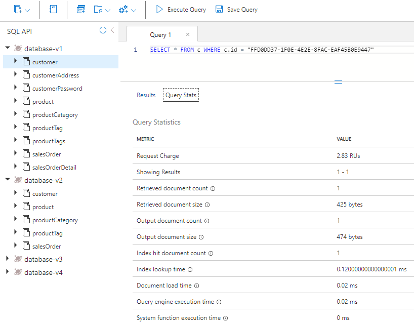

---
lab:
  title: Messen der Leistung für Kundenentitäten
  module: Module 8 - Implement a data modeling and partitioning strategy for Azure Cosmos DB for NoSQL
---

# Messen der Leistung für Kundenentitäten

In dieser Übung messen Sie für die Kundenentitäten, welcher Unterschied zwischen der Modellierung von Entitäten als separate Container und der Modellierung für eine NoSQL-Datenbank besteht, bei der Entitäten in ein einzelnes Dokument eingebettet werden.

## Vorbereiten Ihrer Entwicklungsumgebung

Wenn Sie das Labcoderepository **DP-420** noch nicht in die Umgebung geklont haben, in der Sie an diesem Lab arbeiten werden, führen Sie die folgenden Schritte aus, um dies zu tun. Öffnen Sie andernfalls den zuvor geklonten Ordner in **Visual Studio Code**.

1. Starten Sie **Visual Studio Code**.

    > &#128221; Wenn Sie mit der Visual Studio Code-Schnittstelle noch nicht vertraut sind, lesen Sie das [Handbuch „Erste Schritte“ für Visual Studio Code][code.visualstudio.com/docs/getstarted].

1. Öffnen Sie die Befehlspalette, und führen Sie den Befehl **Git: Clone** aus, um das GitHub-Repository ``https://github.com/microsoftlearning/dp-420-cosmos-db-dev`` in einem lokalen Ordner Ihrer Wahl zu klonen.

    > &#128161; Sie können die Tastenkombination **STRG+UMSCHALTTASTE+P** verwenden, um die Befehlspalette zu öffnen.

1. Nachdem das Repository geklont wurde, öffnen Sie den lokalen Ordner, den Sie in **Visual Studio Code** ausgewählt haben.

1. Navigieren Sie in **Visual Studio Code** im Bereich **Explorer** zum Ordner **16-measure-performance**.

1. Öffnen Sie das Kontextmenü für den Ordner **16-measure-performance**, und wählen Sie **In integriertem Terminal öffnen** aus, um eine neue Terminalinstanz zu öffnen.

1. Wenn ein **Windows PowerShell**-Terminal geöffnet wird, öffnen Sie ein neues **Git Bash**-Terminal.

    > &#128161; Um ein **Git Bash**-Terminal zu öffnen, klicken Sie auf der rechten Seite des Terminalmenüs neben dem Symbol **+** auf das Pulldownmenü, und wählen Sie *Git Bash* aus.

1. Führen Sie im **Git Bash-Terminal** die folgenden Befehle aus. Die Befehle öffnen ein Browserfenster, um eine Verbindung mit dem Azure-Portal herzustellen, in dem Sie die bereitgestellten Lab-Anmeldeinformationen verwenden.

    ```
    "C:\Program Files (x86)\Microsoft SDKs\Azure\CLI2\python.exe" -m pip install pip-system-certs
    az login
    dotnet add package Microsoft.Azure.Cosmos --version 3.22.1

    ```
    > &#128161; Wenn Sie zuerst das Lab **Kosten für die Denormalisierung von Daten** ausgeführt haben und die von diesem Lab erstellten Azure-Ressourcen nicht entfernt haben, schließen Sie das integrierte Terminal, ignorieren Sie den folgenden Schritt, und wechseln Sie zum nächsten Abschnitt. Beachten Sie, dass das Skript fehlschlägt, wenn Sie bereits über die Ressourcen verfügen, die durch das Lab **Kosten für die Denormalisierung von Daten** erstellt wurden, und Sie versuchen, das folgende Skript auszuführen.

    > &#128221; Wenn Sie für dieses Lab die kostenlose Stufe von Cosmos DB verwenden, müssen Sie die Datei ***azuredeploy.json*** aktualisieren und den Durchsatz für alle Datenbanken und Container von 4000 auf 1000 ändern.

1. Führen Sie im **Git Bash-Terminal** die folgenden Befehle aus. Mit diesen Befehlen wird ein Skript zum Erstellen eines neuen Azure Cosmos DB-Kontos ausgeführt und anschließend die App erstellt und gestartet, mit der Sie die Datenbank mit Daten füllen und die Übungen durchführen. *Nachdem Sie die bereitgestellten Anmeldeinformationen für das Azure-Konto eingegeben haben, kann der Build 15–20 Minuten dauern, sodass dies ein guter Zeitpunkt sein kann, sich einen Kaffee oder Tee zu besorgen*.

    ```
    bash init.sh
    dotnet build
    dotnet run --load-data
    echo "Data load process completed."

    ```
1. Schließen Sie das integrierte Terminal.

## Messen der Leistung von Entitäten in separaten Containern

In Database-v1 werden Daten in einzelnen Containern gespeichert. Führen Sie in dieser Datenbank Abfragen aus, um den Kunden, die Kundenadresse und das Kundenkennwort abzurufen. Überprüfen Sie die Anforderungsgebühr für jede dieser Abfragen.

### Abfragen der Kundenentität

Führen Sie in Database-v1 eine Abfrage aus, um die Kundenentität abzurufen und die Anforderungsgebühr zu überprüfen.

1. Öffnen Sie in einem neuen Webbrowserfenster oder einer neuen Registerkarte das Azure-Portal (``portal.azure.com``).

1. Melden Sie sich mit den Microsoft-Anmeldeinformationen, die Ihrem Abonnement zugeordnet sind, beim Portal an.

1. Wählen Sie im Menü des Azure-Portals oder auf der **Startseite** die Option **Azure Cosmos DB** aus.
1. Wählen Sie das Azure Cosmos DB-Konto aus, dessen Name mit **cosmicworks** beginnt.
1. Wählen Sie auf der linken Seite **Data Explorer** aus.
1. Erweitern Sie **Database-v1**.
1. Wählen Sie den Container **Customer** aus.
1. Wählen Sie oben in der Ansicht **Neue SQL-Abfrage** aus.
1. Kopieren Sie den folgenden SQL-Text, fügen Sie ihn ein, und wählen Sie dann **Abfrage ausführen** aus.

    ```
    SELECT * FROM c WHERE c.id = "FFD0DD37-1F0E-4E2E-8FAC-EAF45B0E9447"
    ```

1. Wählen Sie die Registerkarte **Abfragestatistiken** aus, und notieren Sie sich die Anforderungsgebühr in Höhe von 2,83.

    

### Abfragen der Kundenadresse

Führen Sie eine Abfrage aus, um die Entität der Kundenadresse abzurufen und die Anforderungsgebühr zu überprüfen.

1. Wählen Sie den Container **CustomerAddress** aus.
1. Wählen Sie oben in der Ansicht **Neue SQL-Abfrage** aus.
1. Kopieren Sie den folgenden SQL-Text, fügen Sie ihn ein, und wählen Sie dann **Abfrage ausführen** aus.

    ```
    SELECT * FROM c WHERE c.customerId = "FFD0DD37-1F0E-4E2E-8FAC-EAF45B0E9447"
    ```

1. Wählen Sie die Registerkarte **Abfragestatistiken** aus, und notieren Sie sich die Anforderungsgebühr in Höhe von 2,83.

    

### Abfragen des Kundenkennworts

Führen Sie eine Abfrage aus, um die Entität des Kundenkennworts abzurufen und die Anforderungsgebühr zu überprüfen.

1. Wählen Sie den Container **CustomerPassword** aus.
1. Wählen Sie oben in der Ansicht **Neue SQL-Abfrage** aus.
1. Kopieren Sie den folgenden SQL-Text, fügen Sie ihn ein, und wählen Sie dann **Abfrage ausführen** aus.

    ```
    SELECT * FROM c WHERE c.id = "FFD0DD37-1F0E-4E2E-8FAC-EAF45B0E9447"
    ```

1. Wählen Sie die Registerkarte **Abfragestatistiken** aus, und notieren Sie sich die Anforderungsgebühr in Höhe von 2,83.

    

### Addieren der Anforderungsgebühren

Nachdem Sie nun alle Abfragen ausgeführt haben, addieren Sie die Kosten aller Anforderungseinheiten (Request Unit, RU/s) für diese Abfragen.

|**Abfrage**|**RU/s-Kosten**|
|---------|---------|
|Kunde|2.83|
|Kundenadresse|2.83|
|Kundenkennwort|2.83|
|**RU/s gesamt**|**8.49**|

## Messen der Leistung eingebetteter Entitäten

Nun fragen Sie dieselben Informationen ab, mit dem Unterschied, dass die Entitäten dieses Mal in ein einzelnes Dokument eingebettet sind.

1. Wählen Sie die Datenbank **Database-v2** aus.
1. Wählen Sie den Container **Customer** aus.
1. Führen Sie die folgende Abfrage aus. 

    ```
    SELECT * FROM c WHERE c.id = "FFD0DD37-1F0E-4E2E-8FAC-EAF45B0E9447"
    ```

1. Beachten Sie, dass die zurückgegebenen Daten jetzt in einer Hierarchie aus Kunden-, Adress- und Kennwortdaten angeordnet sind.

    

1. Wählen Sie **Abfragestatistiken** aus, und notieren Sie sich die Anforderungsgebühr von 2,83 im Vergleich zu den 8,49 RU/s für die drei zuvor ausgeführten Abfragen.

## Vergleichen der Leistung der beiden Modelle

Wenn Sie die RU/s-Werte für jede der von Ihnen ausgeführten Abfragen vergleichen, stellen Sie fest, dass die letzte Abfrage, bei der sich die Kundenentitäten in einem einzelnen Dokument befinden, wesentlich kostengünstiger ist als die kombinierten Kosten, die entstehen, wenn Sie die drei Abfragen unabhängig voneinander ausführen. Die Wartezeit für die Rückgabe dieser Daten ist geringer, da die Daten in einem einzigen Vorgang zurückgegeben werden.

Wenn Sie nach einem einzigen Element suchen und den Partitionsschlüssel und die ID der Daten kennen, können Sie diese Daten mithilfe des Azure Cosmos DB-SDK per *Punktlesevorgang* abrufen, indem Sie `ReadItemAsync()` aufrufen. Ein Punktlesevorgang ist sogar noch schneller als unsere Abfrage. Für dieselben Kundendaten betragen die Kosten nur 1 RU/s, was eine fast dreifache Verbesserung ist.

## Bereinigung

Löschen Sie die in diesem Lab erstellte Ressourcengruppe.  Wenn Sie nicht über den Zugriff zum Entfernen der Ressourcengruppe verfügen, entfernen Sie alle Azure-Objekte, die von diesem Lab erstellt wurden.

[code.visualstudio.com/docs/getstarted]: https://code.visualstudio.com/docs/getstarted/tips-and-tricks
