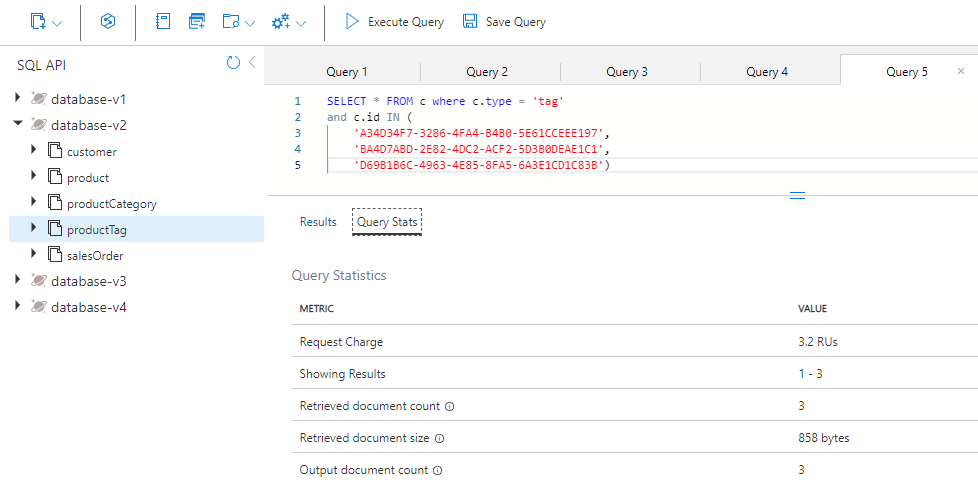

---
lab:
  title: Kosten für die Denormalisierung von Daten und Aggregaten und die Verwendung des Änderungsfeeds für die referentielle Integrität
  module: Module 8 - Implement a data modeling and partitioning strategy for Azure Cosmos DB for NoSQL
---

# Kosten für die Denormalisierung von Daten und Aggregaten und die Verwendung des Änderungsfeeds für die referentielle Integrität

Die Verwendung des relationalen Modells könnte es uns ermöglichen, unterschiedliche Entitäten in eigenen Containern zu platzieren.  In NoSQL-Datenbanken gibt es jedoch keine *Joins* zwischen Containern, sodass wir beginnen müssen, unsere Daten zu denormalisieren, um die Verwendung von *Joins* zu beseitigen. Darüber hinaus reduziert NoSQL die Anzahl der Anforderungen, indem die Daten modelliert werden, sodass die Anwendungen ihre Daten mit möglichst wenigen Anforderungen abrufen können. Ein Problem bei der Denormalierung unserer Daten könnte die referentielle Integrität zwischen unseren Entitäten sein. Dafür können wir den Änderungsfeed verwenden, um die Daten synchron zu halten. Das Denormalisieren Ihrer Aggregate wie „Gruppieren nach“-Zahlen kann uns auch dabei helfen, Anforderungen zu reduzieren.  

In diesem Lab sehen Sie sich die Vorteile der Denormalisierung von Daten und Aggregaten an, die uns helfen kann, Kosten zu senken. Außerdem sehen Sie, wie wir den Änderungsfeed verwenden können, um die referentielle Integrität der denormalisierten Daten aufrechtzuerhalten.

## Vorbereiten Ihrer Entwicklungsumgebung

Wenn Sie das Labcoderepository **DP-420** noch nicht in die Umgebung geklont haben, in der Sie an diesem Lab arbeiten werden, führen Sie die folgenden Schritte aus, um dies zu tun. Öffnen Sie andernfalls den zuvor geklonten Ordner in **Visual Studio Code**.

1. Starten Sie **Visual Studio Code**.

    > &#128221; Wenn Sie mit der Visual Studio Code-Schnittstelle noch nicht vertraut sind, lesen Sie das [Handbuch „Erste Schritte“ für Visual Studio Code][code.visualstudio.com/docs/getstarted].

1. Öffnen Sie die Befehlspalette, und führen Sie den Befehl **Git: Clone** aus, um das GitHub-Repository ``https://github.com/microsoftlearning/dp-420-cosmos-db-dev`` in einem lokalen Ordner Ihrer Wahl zu klonen.

    > &#128161; Sie können die Tastenkombination **STRG+UMSCHALTTASTE+P** verwenden, um die Befehlspalette zu öffnen.

1. Nachdem das Repository geklont wurde, öffnen Sie den lokalen Ordner, den Sie in **Visual Studio Code** ausgewählt haben.

1. Navigieren Sie in **Visual Studio Code** im Bereich **Explorer** zum Ordner **17-denormalize**.

1. Öffnen Sie das Kontextmenü für den Ordner **17-denormalize**, und wählen Sie **In integriertem Terminal öffnen** aus, um eine neue Terminalinstanz zu öffnen.

1. Wenn ein **Windows PowerShell**-Terminal geöffnet wird, öffnen Sie ein neues **Git Bash**-Terminal.

    > &#128161; Um ein **Git Bash**-Terminal zu öffnen, klicken Sie auf der rechten Seite des Terminalmenüs neben dem Symbol **+** auf das Pulldownmenü, und wählen Sie *Git Bash* aus.

1. Führen Sie im **Git Bash-Terminal** die folgenden Befehle aus. Die Befehle öffnen ein Browserfenster, um eine Verbindung mit dem Azure-Portal herzustellen, in dem Sie die bereitgestellten Lab-Anmeldeinformationen verwenden.

    ```
    "C:\Program Files (x86)\Microsoft SDKs\Azure\CLI2\python.exe" -m pip install pip-system-certs
    az login
    cd 17-denormalize
    dotnet add package Microsoft.Azure.Cosmos --version 3.22.1
    ```

    > &#128161; Wenn Sie zuerst das Lab **Messen der Leistung für Kundenentitäten** ausgeführt haben und die von diesem Labor erstellten Azure-Ressourcen nicht entfernt haben, schließen Sie das integrierte Terminal, ignorieren Sie den folgenden Schritt, und wechseln Sie zum nächsten Abschnitt. Beachten Sie, dass das Skript fehlschlägt, wenn Sie bereits über die Ressourcen verfügen, die vom Lab **Messen der Leistung für Kundenentitäten** erstellt wurden, und Sie versuchen, das folgende Skript auszuführen.

1. Führen Sie im **Git Bash-Terminal** die folgenden Befehle aus. Mit diesen Befehlen werden ein Skript zum Erstellen eines neuen Azure Cosmos DB-Kontos ausgeführt und anschließend die App erstellt und gestartet, mit der Sie die Datenbank mit Daten füllen und die Übungen durchführen. *Nachdem Sie die bereitgestellten Anmeldeinformationen für das Azure-Konto eingegeben haben, kann der Build 15–20 Minuten dauern, sodass dies ein guter Zeitpunkt sein kann, sich einen Kaffee oder Tee zu besorgen*.

    ```
    bash init.sh
    dotnet build
    dotnet run --load-data
    echo "Data Load completed."

    ```

1. Schließen Sie das integrierte Terminal.

## Übung 1: Messen von Leistungskosten beim Denormalisieren von Daten

### Abfragen des Produktkategorienamens

Führen Sie im Container **database-v2**, in dem Daten in einzelnen Containern gespeichert sind, eine Abfrage aus, um den Produktkategorienamen abzurufen, und zeigen Sie dann die Anforderungskosten für diese Abfrage an.

1. Öffnen Sie in einem neuen Webbrowserfenster oder einer neuen Registerkarte das Azure-Portal (``portal.azure.com``).

1. Melden Sie sich mit den Microsoft-Anmeldeinformationen, die Ihrem Abonnement zugeordnet sind, beim Portal an.

1. Wählen Sie im linken Bereich **Azure Cosmos DB** aus.
1. Wählen Sie das Azure Cosmos DB-Konto aus, dessen Name mit **cosmicworks** beginnt.
1. Wählen Sie im linken Bereich **Daten-Explorer** aus.
1. Erweitern Sie **database-v2**.
1. Wählen Sie den Container **productCategory** aus.
1. Wählen Sie oben auf der Seite **Neue SQL-Abfrage** aus.
1. Fügen Sie im Bereich **Abfrage 1** den folgenden SQL-Code ein, und wählen Sie dann **Abfrage ausführen** aus.

    ```
    SELECT * FROM c where c.type = 'category' and c.id = "AB952F9F-5ABA-4251-BC2D-AFF8DF412A4A"
    ```

1. Wählen Sie die Registerkarte **Ergebnisse** aus, um die Ergebnisse zu überprüfen. Sie sehen, dass diese Abfrage den Namen der Produktkategorie („Components, Headsets“) zurückgibt.

    

1. Wählen Sie die Registerkarte **Abfragestatistiken** aus, und notieren Sie sich die Anforderungskosten in Höhe von 2,92 RU (Anforderungseinheiten).

    

### Abfragen der Produkte in der Kategorie

Fragen Sie als Nächstes den Container „product“ ab, um alle Produkte für die Kategorie „Components, Headsets“ abzurufen.

1. Wählen Sie den Container **product** aus.
1. Wählen Sie oben auf der Seite **Neue SQL-Abfrage** aus.
1. Fügen Sie im Bereich **Abfrage 2** den folgenden SQL-Code ein, und wählen Sie dann **Abfrage ausführen** aus.

    ```
    SELECT * FROM c where c.categoryId = "AB952F9F-5ABA-4251-BC2D-AFF8DF412A4A"
    ```

1. Wählen Sie die Registerkarte **Ergebnisse** aus, um die Ergebnisse zu überprüfen. Es werden drei Produkte zurückgegeben: „HL Headset“, „LL Headset“ und „ML Headset“. Jedes Produkt verfügt über eine SKU, einen Namen, einen Preis und ein Array von Produkttags.

1. Wählen Sie die Registerkarte **Abfragestatistiken** aus, und notieren Sie sich die Anforderungskosten in Höhe von 2,89 RU.

    

### Abfragen der Tags der einzelnen Produkte

Fragen Sie als Nächstes den Container „productTag“ drei Mal nach den drei Produkten ab: „HL Headset“, „LL Headset“ und „ML Headset“.

#### Tags für „HL Headset“

Führen Sie zunächst eine Abfrage aus, um die Tags für „HL Headset“ zurückzugeben.

1. Wählen Sie den Container **productTag** aus.
1. Wählen Sie oben auf der Seite **Neue SQL-Abfrage** aus.
1. Fügen Sie im Bereich **Abfrage 3** den folgenden SQL-Code ein, und wählen Sie dann **Abfrage ausführen** aus.

    ```
    SELECT * FROM c where c.type = 'tag' and c.id IN ('87BC6842-2CCA-4CD3-994C-33AB101455F4', 'F07885AF-BD6C-4B71-88B1-F04295992176')
    ```

    Diese Abfrage gibt die beiden Tags für das Produkt „HL Headset“ zurück.

1. Wählen Sie die Registerkarte **Abfragestatistiken** aus, und notieren Sie sich die Anforderungskosten in Höhe von 3,06 RU/s.

    

#### Tags für „LL Headset“

Führen Sie nun eine Abfrage aus, um die Tags für „LL Headset“ zurückzugeben.

1. Wählen Sie den Container **productTag** aus.
1. Wählen Sie oben auf der Seite **Neue SQL-Abfrage** aus.
1. Fügen Sie im Bereich **Abfrage 4** den folgenden SQL-Code ein, und wählen Sie dann **Abfrage ausführen** aus.

    ```
    SELECT * FROM c where c.type = 'tag' and c.id IN ('18AC309F-F81C-4234-A752-5DDD2BEAEE83', '1B387A00-57D3-4444-8331-18A90725E98B', 'C6AB3E24-BA48-40F0-A260-CB04EB03D5B0', 'DAC25651-3DD3-4483-8FD1-581DC41EF34B', 'E6D5275B-8C42-47AE-BDEC-FC708DB3E0AC')
    ```

    Diese Abfrage gibt die fünf Tags für das Produkt „LL Headset“ zurück.

1. Wählen Sie die Registerkarte **Abfragestatistiken** aus, und notieren Sie sich die Anforderungskosten in Höhe von 3,45 RU.

    

#### Tags für „ML Headset“

Führen Sie zuletzt eine Abfrage aus, um die Tags für „ML Headset“ zurückzugeben.

1. Wählen Sie den Container **productTag** aus.
1. Wählen Sie oben auf der Seite **Neue SQL-Abfrage** aus.
1. Fügen Sie im Bereich **Abfrage 5** den folgenden SQL-Code ein, und wählen Sie dann **Abfrage ausführen** aus.

    ```
    SELECT * FROM c where c.type = 'tag' and c.id IN ('A34D34F7-3286-4FA4-B4B0-5E61CCEEE197', 'BA4D7ABD-2E82-4DC2-ACF2-5D3B0DEAE1C1', 'D69B1B6C-4963-4E85-8FA5-6A3E1CD1C83B')
    ```

    Diese Abfrage gibt die drei Tags für das Produkt „ML Headset“ zurück.

1. Wählen Sie die Registerkarte **Abfragestatistiken** aus, und notieren Sie sich die Anforderungskosten in Höhe von 3,19 RU.

    

### Addieren der RU/s-Kosten

Nun werden alle RU/s-Kosten der einzelnen ausgeführten Abfragen addiert.

|**Abfrage**|**RU/s-Kosten**|
|---------|---------|
|Kategoriename|2.92|
|Produkt|2.89|
|HL-Produkttags|3.06|
|LL-Produkttags|3.45|
|ML-Produkttags|3,19|
|**RU/s-Gesamtkosten**|**15,51**|

### Ausführen derselben Abfragen beim NoSQL-Design

Fragen Sie nun dieselben Informationen ab, jetzt aber in der denormalisierten Datenbank.

1. Wählen Sie in Data Explorer **database-v3** aus.
1. Wählen Sie den Container **product** aus.
1. Wählen Sie oben auf der Seite **Neue SQL-Abfrage** aus.
1. Fügen Sie im Bereich **Abfrage 6** den folgenden SQL-Code ein, und wählen Sie dann **Abfrage ausführen** aus.

    ```
   SELECT * FROM c where c.categoryId = "AB952F9F-5ABA-4251-BC2D-AFF8DF412A4A"
   ```

    Die Ergebnisse sehen in etwa wie folgt aus:

    

1. Überprüfen Sie die in dieser Abfrage zurückgegebenen Daten. Sie enthalten alle Informationen, die zum Rendern der Produkte für diese Kategorie erforderlich sind, einschließlich des Kategorienamens und der Tagnamen für alle drei Produkte.

1. Wählen Sie die Registerkarte **Abfragestatistiken** aus, und notieren Sie sich die Anforderungskosten in Höhe von 2,89 RU.

### Vergleichen der Leistung der beiden Modelle

Im relationalen Modell, in dem Daten in einzelnen Containern gespeichert sind, haben Sie fünf Abfragen ausgeführt, um den Namen der Kategorie, alle Produkte dieser Kategorie und alle Produkttags für die einzelnen Produkte abzurufen. Die Anforderungskosten für die fünf Abfragen betrugen insgesamt 15,56 RUs.

Um dieselben Informationen im NoSQL-Modell zu erhalten, haben Sie nur eine Abfrage ausgeführt, bei der die Anforderungskosten 2,9 RU/s betrugen.

Zu den Vorteilen eines NoSQL-Designs wie bei diesem Modell zählen nicht nur die geringeren Kosten. Diese Art von Design ist auch schneller, da nur eine einzige Anforderung erforderlich ist. Außerdem werden die eigentlichen Daten schon in der Form ausgegeben, in der sie wahrscheinlich auf einer Webseite gerendert werden. Das bedeutet, dass in Ihrer E-Commerce-Anwendung weniger Code geschrieben werden muss und weniger Downstreamverwaltung erforderlich ist.

Wenn Sie Daten denormalisieren, generieren Sie einfachere, effizientere Abfragen für Ihre E-Commerce-Anwendung. Sie können alle Daten, die von Ihrer Anwendung benötigt werden, in einem einzelnen Container speichern und mit einer einzigen Abfrage abrufen. Wenn Sie viele Abfragen mit hoher Parallelität haben, kann diese Art von Datenmodellierung in Bezug auf Einfachheit, Geschwindigkeit und Kosten enorme Vorteile bieten.

---

## Übung 2: Verwalten der referentiellen Integrität mithilfe des Änderungsfeeds

In dieser Lerneinheit erfahren Sie, wie der Änderungsfeed die referenzielle Integrität zwischen zwei Containern in Azure Cosmos DB gewährleisten kann. In diesem Szenario verwenden Sie den Änderungsfeed, um auf den Container „productCategory“ zu lauschen. Wenn Sie den Namen einer Produktkategorie aktualisieren, erfasst der Änderungsfeed den aktualisierten Namen und aktualisiert alle Produkte in dieser Kategorie mit dem neuen Namen.

In dieser Übung führen Sie die folgenden Schritte aus:

- Vervollständigen von C#-Code, um wichtige Konzepte hervorzuheben, die Sie verstehen müssen.
- Starten des Änderungsfeedprozessors, damit er mit der Überwachung des Containers „productCategory“ beginnt.
- Abfragen des Containers „product“ nach der Kategorie, deren Namen Sie ändern möchten, sowie nach der darin enthaltenen Produktanzahl.
- Aktualisieren des Kategorienamens und Beobachten, wie der Änderungsfeed die Änderungen an den Container „product“ weitergibt.
- Abfragen des neuen Containers „product“ mit dem neuen Kategorienamen und Zählen der Anzahl der Produkte, um sicherzustellen, dass alle aktualisiert wurden.
- Zurückändern des Namens in den ursprünglichen Namen und Beobachten, wie der Änderungsfeed die erneuten Änderungen weitergibt.

### Starten von Azure Cloud Shell und Öffnen von Visual Studio Code

Führen Sie die folgenden Schritte aus, um zu dem Code zu gelangen, den Sie für den Änderungsfeed aktualisieren möchten:

1. Wenn Visual Studio Code noch nicht geöffnet ist, öffnen Sie es, und öffnen Sie die Datei *Program.cs* im Ordner *17-denormalize*.

### Vervollständigen des Codes für den Änderungsfeed

Fügen Sie Code hinzu, um die an den Delegaten übergebenen Änderungen zu verarbeiten, durchlaufen Sie die einzelnen Produkte für diese Kategorie, und aktualisieren Sie sie.

1. Navigieren Sie dann zu der Funktion, die den Änderungsfeedprozessor startet.

1. Drücken Sie STRG+G, und geben Sie dann **603** ein, um zu dieser Zeile in der Datei zu navigieren.

1. Jetzt sollte der folgende Code angezeigt werden:

    

   In den Zeilen 588 und 589 befinden sich zwei Containerverweise. Sie müssen diese mit den richtigen Containernamen aktualisieren. Der Änderungsfeed erstellt eine Instanz des Änderungsfeedprozessors für den Containerverweis. In diesem Fall können Sie Änderungen am Container „productCategory“ beobachten.

1. Ersetzen Sie in Zeile 588 **{container to watch}** durch `productCategory`.

1. Ersetzen Sie in Zeile 589 **{container to update}** durch `product`. Wenn ein Produktkategoriename aktualisiert wird, muss jedes Produkt in dieser Kategorie mit dem neuen Produktkategorienamen aktualisiert werden.

1. Überprüfen Sie unterhalb der Zeilen *container to watch* und *container to update* die Zeile *leaseContainer*. „leaseContainer“ funktioniert wie ein Prüfpunkt für den Container. Er weiß, was seit der letzten Überprüfung durch den Änderungsfeedprozessor aktualisiert wurde.
  
   Wenn der Änderungsfeed eine neue Änderung erkennt, ruft er einen Delegaten auf und übergibt die Änderungen in einer schreibgeschützten Sammlung.

1. In Zeile 603 müssen Sie Code hinzufügen, der aufgerufen wird, wenn der Änderungsfeed eine neue Änderung verarbeiten muss. Kopieren Sie dazu den folgenden Codeschnipsel, und fügen Sie ihn unterhalb der Zeile ein, die mit **//To-Do:** beginnt.

    ```
    //Fetch each change to productCategory container
    foreach (ProductCategory item in input)
    {
        string categoryId = item.id;
        string categoryName = item.name;
    
        tasks.Add(UpdateProductCategoryName(productContainer, categoryId, categoryName));
    }
    ```

1. Ihr Code sollte nun wie in der folgenden Abbildung aussehen:

    

    Standardmäßig wird der Änderungsfeed ein Mal pro Sekunde ausgeführt. In Szenarien, in denen viele Einfügungen oder Aktualisierungen im überwachten Container vorgenommen werden, kann der Delegat mehrere Änderungen aufweisen. Aus diesem Grund geben Sie den Delegaten **input** als **IReadOnlyCollection** ein.

    Dieser Codeschnipsel durchläuft alle Änderungen im Delegaten **input** und speichert sie als Zeichenfolgen für **categoryId** und **categoryName**. Anschließend wird der Taskliste ein Task mit einem Aufruf einer anderen Funktion hinzugefügt, die den Produktcontainer mit dem neuen Kategorienamen aktualisiert.

1. Drücken Sie STRG+G, und geben Sie dann **647** ein, um die Funktion **UpdateProductCategoryName()** zu suchen. Hier müssen Sie Code schreiben, mit dem jedes Produkt im Container „product“ mit dem neuen Kategorienamen aktualisiert wird, der vom Änderungsfeed erfasst wurde.

1. Kopieren Sie den folgenden Codeausschnitt, und fügen Sie ihn unterhalb der Zeile ein, die mit **//To-Do:** beginnt. Die Funktion führt nur zwei Aktionen aus. Zuerst wird der Produktcontainer nach allen Produkten für die übergebene **categoryId** abgefragt. Anschließend wird jedes Produkt mit dem neuen Produktkategorienamen aktualisiert.

    ```
    //Loop through all products
    foreach (Product product in response)
    {
        productCount++;
        //update category name for product
        product.categoryName = categoryName;
    
        //write the update back to product container
        await productContainer.ReplaceItemAsync(
            partitionKey: new PartitionKey(categoryId),
            id: product.id,
            item: product);
    }
    ```

    Ihr Code sollte jetzt folgendermaßen aussehen.

    

    Der Code liest die Zeilen aus dem Antwortobjekt der Abfrage und aktualisiert dann den Container „product“ mit allen Produkten, die von der Abfrage zurückgegeben werden.

    Sie verwenden eine **foreach()**-Schleife, um jedes von der Abfrage zurückgegebene Produkt zu durchlaufen. Für jede Zeile aktualisieren Sie einen Zähler, damit Sie wissen, wie viele Produkte aktualisiert wurden. Aktualisieren Sie dann den Kategorienamen für das Produkt in den neuen **categoryName**. Zuletzt rufen Sie **ReplaceItemAsync()** auf, um das Produkt im Container „product“ erneut zu aktualisieren.

1. Drücken Sie STRG+S zum Speichern der Änderungen.

1. Wenn es noch nicht geöffnet ist, öffnen Sie ein integriertes Git Bash-Terminal, und stellen Sie sicher, dass Sie sich im Ordner *17-denormalize* befinden.

1. Führen Sie den folgenden Befehl aus, um das Projekt zu kompilieren und auszuführen:

    ```
    dotnet build
    dotnet run
    ```

1. Auf Ihrem Bildschirm sollte jetzt das Hauptmenü für die Anwendung angezeigt werden.

    

### Ausführen des Änderungsfeedbeispiels

Nachdem Sie den Code für den Änderungsfeed vervollständigt haben, möchten wir ihn in Aktion sehen.

1. Wählen Sie im Hauptmenü **a** aus, um den Änderungsfeedprozessor zu starten. Auf dem Bildschirm wird der Fortschritt angezeigt.

    

1. Drücken Sie eine beliebige Taste, um zum Hauptmenü zurückzukehren.

1. Wählen Sie im Hauptmenü **b** aus, um den Namen der Produktkategorie zu aktualisieren. Folgendes passiert (in der genannten Reihenfolge):

    a. Abfragen des Containers „product“ nach der Kategorie „Accessories, Tires, and Tubes“ und Zählen, wie viele Produkte in dieser Kategorie enthalten sind.  
    b. Aktualisieren des Kategorienamens und Ersetzen des Worts „und“ durch ein kaufmännisches Und-Zeichen („&“).  
    c. Der Änderungsfeed greift diese Änderung auf und aktualisiert mit dem von Ihnen geschriebenen Code alle Produkte in dieser Kategorie.  
    d. Anschließend macht der Änderungsfeed die Namensänderung rückgängig und ändert den Kategorienamen erneut, wobei „&“ durch das ursprüngliche „und“ ersetzt wird.  
    e. Der Änderungsfeed greift diese Änderung auf und aktualisiert alle Produkte erneut mit dem ursprünglichen Produktkategorienamen.

1. Wählen Sie im Hauptmenü **b** aus, und folgen Sie den Eingabeaufforderungen, bis der Änderungsfeed ein zweites Mal ausgeführt wird, und halten Sie ihn dann an. Die Ergebnisse sehen wie folgt aus:

    

1. Wenn Sie zu weit geklickt haben und zum Hauptmenü zurückgekehrt sind, wählen Sie erneut **b** aus, um die Änderungen zu beobachten.

1. Geben Sie, wenn Sie fertig sind, **x** ein, um die Anwendung zu beenden und zu Azure Cloud Shell zurückzukehren.

---

## Übung 3: Denormalisieren von Aggregaten

In dieser Lerneinheit erfahren Sie, wie Sie ein Aggregat denormalisieren, um die Abfrage für die 10 wichtigsten Kunden für Ihre E-Commerce-Website zu schreiben. Sie verwenden das Feature für transaktionale Batches im Azure Cosmos DB .NET SDK, das gleichzeitig einen neuen Verkaufsauftrag einfügt und die Eigenschaft **salesOrderCount** der Kundschaft aktualisiert, die sich beide in derselben logischen Partition befinden.

In dieser Übung führen Sie die folgenden Schritte aus:

- Anzeigen des Codes, um einen neuen Verkaufsauftrag zu erstellen.
- Vervollständigen des C#-Codes, um *salesOrderCount* für den Kunden zu erhöhen.
- Vervollständigen des C#-Codes zum Implementieren der Transaktion zum Einfügen eines neuen Verkaufsauftrags und zum Aktualisieren des Kundendatensatzes mithilfe des Features *Transaktionaler Batch*.
- Ausführen einer Abfrage für einen bestimmten Kunden, um den Kundendatensatz und alle Kundenverkaufsaufträge anzuzeigen.
- Erstellen eines neuen Verkaufsauftrags für diesen Kunden, und aktualisieren seiner Eigenschaft **salesOrderCount**.
- Ausführen der Abfrage der 10 wichtigsten Kunden, um die aktuellen Ergebnisse anzuzeigen.
- Erläutern der Verwendung des transaktionalen Batchs, wenn ein Kunde einen Verkaufsauftrag storniert.

## Öffnen Sie Visual Studio Code.

Führen Sie die folgenden Schritte aus, um den Code abzurufen, den Sie in dieser Lerneinheit verwenden:

1. Wenn Visual Studio Code noch nicht geöffnet ist, öffnen Sie es, und öffnen Sie die Datei *Program.cs* im Ordner *17-denormalize*.

## Vervollständigen des Codes, um die Gesamtanzahl der Verkaufsaufträge zu aktualisieren

1. Navigieren Sie zu der Funktion, die einen neuen Verkaufsauftrag erstellt.

1. Drücken Sie STRG+G, und geben Sie dann **483** ein, um zu dieser Zeile in der Datei zu navigieren.

1. Jetzt sollte der folgende Code angezeigt werden:

    

    Diese Funktion erstellt einen neuen Verkaufsauftrag und aktualisiert den Kundendatensatz mithilfe eines transaktionalen Batchs.

    Zunächst wird der Kundendatensatz durch Aufrufen von **ReadItemAsync()** und Übergeben von **customerId** als Partitionsschlüssel und ID abgerufen.

1. Erhöhen Sie in Zeile 483 unter dem Kommentar **//To-Do:** den Wert von **salesOrderCount**, indem Sie den folgenden Codeschnipsel einfügen:

    ```
    //Increment the salesOrderTotal property
    customer.salesOrderCount++;
    ```

    Ihr Bildschirm sollte nun wie folgt aussehen:

    

## Vervollständigen des Codes zum Implementieren eines Transaktionsbatchs

1. Scrollen Sie nun einige Zeilen nach unten, um die Daten für den neuen Verkaufsauftrag anzuzeigen, den Sie für Ihren Kunden erstellen.

    Ihr neues Verkaufsauftragsobjekt verfügt über eine Header- und Detailstruktur, die typisch für Verkaufsaufträge in einer E-Commerce-Anwendung ist.

    Der Auftragsheader weist **orderId**, **customerId**, **orderDate** und **shipDate** auf, die Sie leer lassen.

    Da Ihr Kundencontainer sowohl Kunden- als auch Verkaufsauftragsentitäten enthält, enthält Ihr Verkaufsauftragsobjekt auch die Diskriminatoreigenschaft **type** mit dem Wert **salesOrder**. Dadurch können Sie im Container „customer“ einen Verkaufsauftrag von einem Kundenobjekt unterscheiden.

    Weiter unten können Sie auch die beiden Produkte für den Verkaufsauftrag erkennen, die den Detailabschnitt in Ihrem Verkaufsauftrag bilden.

1. Scrollen Sie etwas weiter zu einem anderen **//To-Do:**-Kommentar. Hier müssen Sie Code hinzufügen, der einen neuen Verkaufsauftrag einfügt und den Kundendatensatz mithilfe eines transaktionalen Batchs aktualisiert.

1. Kopieren Sie den folgenden Codeschnipsel, und fügen Sie ihn in die Zeile unter dem Kommentar **//To-Do:** ein.

    ```
    TransactionalBatchResponse txBatchResponse = await container.CreateTransactionalBatch(
        new PartitionKey(salesOrder.customerId))
        .CreateItem<SalesOrder>(salesOrder)
        .ReplaceItem<CustomerV4>(customer.id, customer)
        .ExecuteAsync();
    if (txBatchResponse.IsSuccessStatusCode)
        Console.WriteLine("Order created successfully");
    ```

    Dieser Code ruft **CreateTransactionalBatch()** für Ihr Containerobjekt auf. Der Wert des Partitionsschlüssels wird als erforderlicher Parameter übernommen, da sich alle Transaktionen auf eine einzelne logische Partition beziehen. Sie übergeben auch Ihren neuen Verkaufsauftrag durch Aufrufen von **CreateItem()** und Ihr aktualisiertes Kundenobjekt durch Aufrufen von **ReplaceItem()**. Rufen Sie dann **ExecuteAsync()** auf, um die Transaktion auszuführen.

    Überprüfen Sie abschließend, ob die Transaktion erfolgreich war, indem Sie sich das Antwortobjekt anschauen.

    Ihr Bildschirm sollte jetzt folgendermaßen aussehen:

    

1. Drücken Sie STRG+S zum Speichern der Änderungen.

1. Wenn es noch nicht geöffnet ist, öffnen Sie ein integriertes Git Bash-Terminal, und stellen Sie sicher, dass Sie sich im Ordner *17-denormalize* befinden.

1. Führen Sie den folgenden Befehl aus, um das Projekt zu kompilieren und auszuführen:

    ```
    dotnet build
    dotnet run
    ```

1. Auf Ihrem Bildschirm sollte jetzt das Hauptmenü für die Anwendung angezeigt werden (siehe Abbildung):

    

## Abfragen des Kunden und seiner Verkaufsaufträge

Da Sie Ihre Datenbank so entworfen haben, dass durch Verwendung von **customerId** als Partitionsschlüssel sowohl Kundschaft als auch alle zugehörigen Verkaufsaufträge im selben Container gespeichert werden, können Sie in einem einzigen Vorgang den Container „customer“ abfragen und den Datensatz und alle Verkaufsaufträge der Kundschaft zurückgeben.

1. Wählen Sie im Hauptmenü **c** aus, um das Menüelement **Kunde und alle Verkaufsaufträge abfragen** auszuführen. Mit dieser Abfrage wird der Kundendatensatz, gefolgt von allen Verkaufsaufträgen des Kunden, zurückgegeben. Auf dem Bildschirm sollten alle Verkaufsaufträge des Kunden angezeigt werden.

   Beachten Sie, dass **Road-650 Red, 58** für 782,99 USD der letzte Verkaufsauftrag war.

1. Scrollen Sie nach oben bis zu **Kundendatensatz und alle Verkaufsaufträge ausgeben**.

   Beachten Sie, dass für die **salesOrderCount**-Eigenschaft zwei Verkaufsaufträge angezeigt werden.

   Ihr Bildschirm sollte nun folgendermaßen aussehen:

    

## Erstellen eines neuen Verkaufsauftrags und Aktualisieren der Summe der Verkaufsaufträge in einer Transaktion

Erstellen Sie einen neuen Verkaufsauftrag für denselben Kunden, und aktualisieren Sie die Summe der im Kundendatensatz gespeicherten Verkaufsaufträge.

1. Drücken Sie eine beliebige Taste im Fenster, um zum Hauptmenü zurückzukehren.
1. Wählen Sie **d** aus, um das Menüelement **Neuen Auftrag erstellen und Summe der Verkaufsaufträge aktualisieren** auszuführen.
1. Drücken Sie eine beliebige Taste, um zum Hauptmenü zurückzukehren.
1. Wählen Sie **c** aus, um dieselbe Abfrage erneut auszuführen.

   Beachten Sie den neuen Verkaufsauftrag mit **HL Mountain Frame – Black, 38** und **Racing Socks, M**.

1. Scrollen Sie zurück bis zu **Kundendatensatz und alle Verkaufsaufträge ausgeben**.

   Beachten Sie, dass für die **salesOrderCount**-Eigenschaft drei Verkaufsaufträge angezeigt werden.

1. Ihr Bildschirm sollte nun folgendermaßen aussehen:

    

## Löschen eines Auftrags mit dem Feature „Transaktionaler Batch“

Wie bei jeder E-Commerce-Anwendung stornieren Kunden auch Verkaufsaufträge. Dies ist auch hier möglich.

1. Drücken Sie eine beliebige Taste, um zum Hauptmenü zurückzukehren.

1. Wählen Sie **f** aus, um das Menüelement **Verkaufsauftrag löschen und Summe der Verkaufsaufträge aktualisieren** auszuführen.

1. Drücken Sie eine beliebige Taste, um zum Hauptmenü zurückzukehren.
1. Wählen Sie **c** aus, um dieselbe Abfrage erneut auszuführen und zu bestätigen, dass der Kundendatensatz aktualisiert wurde.

   Beachten Sie, dass der neue Verkaufsauftrag nicht mehr zurückgegeben wird. Wenn Sie nach oben scrollen, sehen Sie, dass der Wert **salesOrderCount** auf **2** zurückgesetzt wurde.

1. Drücken Sie eine beliebige Taste, um zum Hauptmenü zurückzukehren.

## Anzeigen des Codes zum Löschen eines Verkaufsauftrags

Sie können einen Verkaufsauftrag genau so löschen wie Sie ihn erstellen. Beide Vorgänge werden in einer Transaktion verpackt und in derselben logischen Partition ausgeführt. Sehen wir uns den Code an, der diese Aktion ausführt.

1. Geben Sie **x** ein, um die Anwendung zu beenden.
1. Wenn Visual Studio Code noch nicht geöffnet ist, öffnen Sie es, und öffnen Sie die Datei *Program.cs* im Ordner *17-denormalize*.

1. Drücken Sie STRG+G, und geben Sie dann **529** ein.

    Diese Funktion löscht den neuen Verkaufsauftrag und aktualisiert den Kundendatensatz.

    Hier können Sie sehen, wie mit dem Code zuerst der Kundendatensatz abgerufen und dann **salesOrderCount** um 1 verringert wird.

    Als Nächstes wird **CreateTransactionalBatch()** aufgerufen. Auch hier wird der Wert des logischen Partitionsschlüssels übergeben, aber dieses Mal werden **DeleteItem()** mit der Verkaufsauftrags-ID und **ReplaceItem()** mit dem aktualisierten Kundendatensatz aufgerufen.

## Anzeigen des Codes für die Abfrage der 10 wichtigsten Kunden

Sehen Sie sich noch einmal die Abfrage der 10 wichtigsten Kunden an.

1. Drücken Sie STRG+G, und geben Sie dann **566** ein.

    Im oberen Bereich befindet sich die Definition für Ihre Abfrage.

    ```
    SELECT TOP 10 c.firstName, c.lastName, c.salesOrderCount
        FROM c WHERE c.type = 'customer'
        ORDER BY c.salesOrderCount DESC
    ```

    Diese Abfrage ist recht einfach mit einer **TOP**-Anweisung, um die Anzahl der zurückgegebenen Datensätze zu begrenzen, und einer **ORDER BY**-Anweisung für unsere **salesOrderCount**-Eigenschaft in absteigender Reihenfolge.

    Beachten Sie auch die Diskriminatoreigenschaft **type** mit dem Wert **customer**, sodass nur Kundschaft zurückgegeben wird, da der Container „customer“ sowohl Kundschaft als auch Verkaufsaufträge enthält.

1. Führen Sie den folgenden Befehl aus, um die Anwendung erneut zu starten, sofern sie noch nicht ausgeführt wird:

    ```
    dotnet run
    ```

1. Geben Sie abschließend **e** ein, um die Abfrage auszuführen.

    

    Möglicherweise haben Sie nicht bemerkt, dass die Abfrage der 10 wichtigsten Kunden eine partitionsübergreifende Abfrage ist, die sich über alle Partitionen in Ihrem Container erstreckt.

    Im Begleitmodul zu diesem Modul wurde darauf hingewiesen, dass Sie versuchen sollten, partitionsübergreifende Abfragen zu vermeiden. In der Realität allerdings können solche Abfragen akzeptabel sein, wenn der Container noch klein ist oder die Abfrage nicht häufig ausgeführt wird. Wenn die Abfrage jedoch häufig ausgeführt wird oder der Container außergewöhnlich groß ist, könnte es sich lohnen, die Kosten für das Speichern der Daten in einem anderen Container und dessen Nutzung für die Abfrage zu untersuchen.

## Bereinigung

Löschen Sie die in dieser Übung erstellte Ressourcengruppe.  Wenn Sie nicht über den Zugriff zum Entfernen der Ressourcengruppe verfügen, entfernen Sie alle Azure-Objekte, die von dieser Übung erstellt wurden.

[code.visualstudio.com/docs/getstarted]: https://code.visualstudio.com/docs/getstarted/tips-and-tricks
